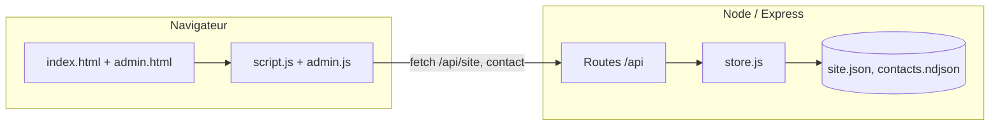

# Architecture du portfolio — front & back

Ce document décrit comment le code est organisé : **interface (HTML/CSS/JS)** et **serveur Node (Express)**.

---

## Vue d’ensemble

| Couche | Rôle |
|--------|------|
| **Front** | Pages statiques + JavaScript qui appelle l’API pour le **contenu du site** (`/api/site`), anime l’UI et affiche **projets** et **références** (données dans `script.js`). |
| **Back** | Serveur Express qui sert les fichiers, expose des routes JSON, gère sessions admin, contact et persistance (`site.json`, journal des contacts). |

Le site doit être ouvert via le serveur (`npm start`), pas en `file://`, pour que `fetch('/api/site')` mette à jour textes et liens dynamiques.

---

## Front-end

### Fichiers principaux

| Fichier | Contenu |
|---------|---------|
| `index.html` | Structure de la page publique : sections (hero, à propos, compétences, projets, références, contact), formulaire, modale projets. Des `id` ciblent les zones mises à jour par l’API (`link-email`, `hero-stats`, etc.). |
| `style.css` | Thème sombre, variables CSS (`:root`), layout responsive, composants (cartes, modale, références, formulaire). |
| `script.js` | Tableaux **`projects`** (fiches détaillées + modale) et **`portfolioReferences`** (cartes « Projets & collaborations » : titre, description, lien). `boot()` charge `/api/site` puis `applySite` + `renderPortfolioReferences()`. |
| `admin.html` | Connexion + formulaire d’édition du site (infos, coordonnées, réseaux). |
| `admin.css` | Styles de la page admin. |
| `admin.js` | Session admin : login, logout, lecture/écriture `/api/admin/site`. |

### Flux de données (page publique)

1. `boot()` appelle `GET /api/site` → objet JSON fusionné côté serveur avec `defaultSite()` et `site.json` si présent.
2. `applySite(site)` met à jour le DOM (identité, hero, about, contact, footer, CV).
3. `renderPortfolioReferences()` lit le tableau **`portfolioReferences`** dans `script.js` et remplit `#reviews-grid` (pas d’API).
4. **`projects`** : uniquement dans `script.js` — `renderProjects()` génère les cartes et la modale.

### Points techniques front

- **Références** : contenu statique dans le code ; titres et descriptions passent par `escapeHtml()` à l’affichage.
- **Formulaire contact** : `POST /api/contact` en JSON.
- **Animations** : `IntersectionObserver` pour `.reveal` et compteurs hero ; canvas particules ; texte animé `#typed` alimenté par l’API site.

---

## Back-end

### Fichiers principaux

| Fichier | Contenu |
|---------|---------|
| `server/index.js` | Express : JSON, sessions, rate limiting, routes API, fichiers statiques. |
| `server/store.js` | `defaultSite()`, `getSite()` / `saveSite()` (merge + `site.json`). |
| `package.json` | `npm start` / `npm dev` ; dépendances : `express`, `express-session`, `express-rate-limit`, `nodemailer`, `dotenv`. |
| `.env.example` | Variables d’environnement. |

### Données persistantes (`server/data/`)

| Fichier | Usage |
|---------|--------|
| `site.json` | Contenu éditable via l’admin (merge avec les défauts du store). |
| `contacts.ndjson` | Si SMTP absent : une ligne JSON par message du formulaire contact. |

### Routes API

**Publiques**

| Méthode | Route | Description |
|---------|--------|-------------|
| `GET` | `/api/health` | Santé du service. |
| `GET` | `/api/site` | Objet site complet. |
| `POST` | `/api/contact` | `{ name, email, projectType?, message }` — validation, rate limit, SMTP ou append `contacts.ndjson`. |

**Admin** (session après `POST /api/admin/login`)

| Méthode | Route | Description |
|---------|--------|-------------|
| `POST` | `/api/admin/login` | `{ password }` — `ADMIN_PASSWORD`, comparaison `timingSafeEqual`. |
| `POST` | `/api/admin/logout` | Détruit la session. |
| `GET` | `/api/admin/me` | `{ ok: true/false }`. |
| `GET` | `/api/admin/site` | Même objet que `/api/site`. |
| `PUT` | `/api/admin/site` | Sauvegarde → `site.json`. |

Puis `express.static` sert le site et `admin.html`.

### Logique métier (`store.js`)

- **`mergeSite`** / **`saveSite`** : site éditable uniquement ; pas de stockage serveur pour les références publiques (gérées dans `script.js`).

### Configuration (`.env`)

- `PORT`, `ADMIN_PASSWORD`, `SESSION_SECRET`, variables SMTP / `MAIL_TO` — voir `.env.example`.

---

## Schéma simplifié



---

## Commandes

```bash
npm install
cp .env.example .env   # puis éditer .env
npm start              # http://localhost:3000
```

- Site public : `/`
- Admin : `/admin.html`

---

## Évolutions possibles

- Exposer **`portfolioReferences`** via une route + admin si tu veux les éditer sans toucher au code.
- Externaliser les **projets** de la même façon.
- `trust proxy` derrière un reverse proxy en HTTPS.
